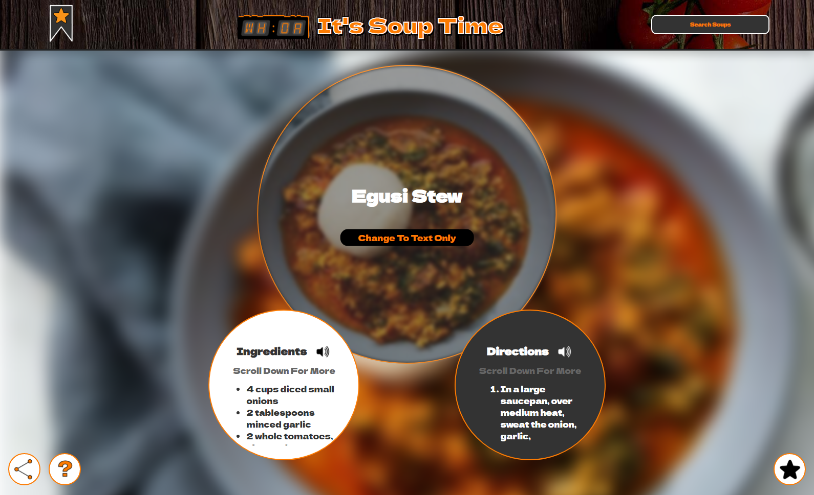
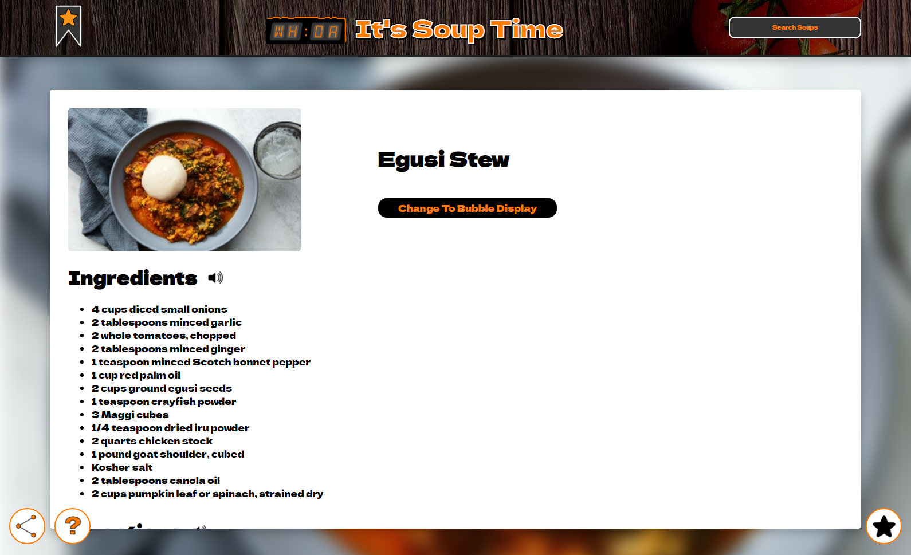
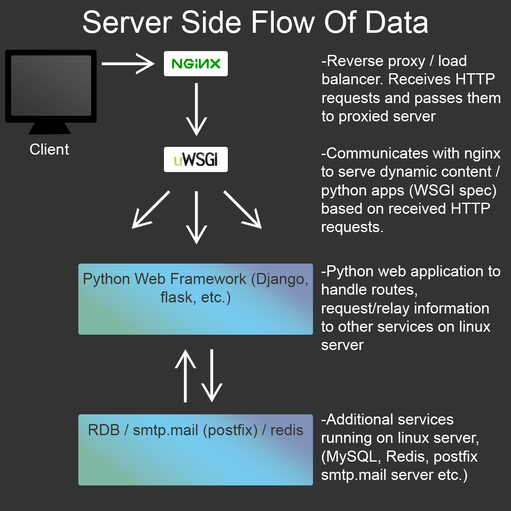
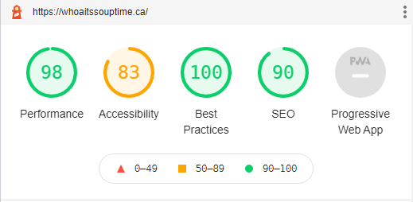

# Whoa It's Soup Time

***https://whoaitssouptime.ca***

Base Website Design For WhoaIt'sSoupTime, with any sensitive information removed. This website is written in HTML/CSS and entirely vanilla Javascript, and hosted using a nginx & uWSGI web server that serves python web applications, all built on linux (of course), and provided by DigitalOcean.

Also in the backend there is a cronjob that is responsible for scheduling the scrapecurious.py file, which scrapes any new soup content from epicurious using BS4, and adds it to our ever-growing database of soups, although epicurious has recently changed their HTML structure, seemingly to stop web-scraping, so we have stopped our web-scrapers from running on their website.

***Homepage Production Version***

Soup Bowl Version

Text-Only Version

-Screenshots taken with Google Chrome Inspector Commands-

***Personal Thoughts***

This is a fun little project that I've been slowly working on for a couple of months. I started the project close to a year ago, wrote some pretty iffy code, and then came back to it after a few months and have been slowly fixing everything. My friends and I had made a few jokes about 'soup time', and I thought it would be a funny idea to create a website, just for some laughs. Despite the humourous start, I really wanted to try and create something different / original for this project. All in all, I like design of the small website, although in the future I definitely plan on going back and redoing the icons, as well as adding a horizontal navbar. 

Additionally I'm currently building out animations in Adobe After Effects and using the bodymoving plugin (https://github.com/airbnb/lottie-web) to render the animations as an inline HTML format.

Finally, in the future I plan on writing other similar webscrapers that can be scheduled to scrape soups from various sources at various times of the week.

***Server Side Flow Of Information/Data***

Documentation / Blogs : 
https://uwsgi-docs.readthedocs.io/en/latest/ (Official uWSGI docs)

https://docs.nginx.com/nginx/admin-guide/web-server/reverse-proxy/ (Official nginx docs)

https://www.ultravioletsoftware.com/single-post/2017/03/23/An-introduction-into-the-WSGI-ecosystem (A helpful blog-post breaking down the different parts of the WSGI ecosystem)

https://goutomroy.medium.com/request-and-response-cycle-in-django-338518096640 (Request and response life cycle in Django, I found helpful for understanding the flow of information)

***Google Inspector Lighthouse Results***

